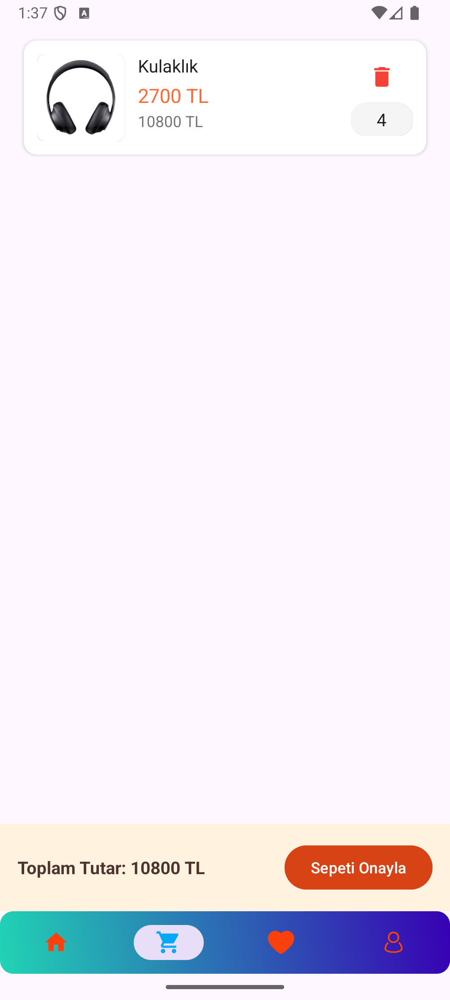

# E Commerce Demo

This E-Commerce app aims user to reach good items with nice looking UI. It is totally written with Kotlin and Android View System.


## Features

- User Register and Login
- See Products
- Add and Delete from basket
- Add and Delete from favorites
- See Profile Status
- See Product Details


## Tech Stack

**Kotlin:** A modern, concise, and safe programming language fully interoperable with Java, ideal for Android development.

**MVVM:** MVVM is the architecture of this project

**Retrofit:** A type-safe HTTP client for Android and the JVM

**Hilt & Dagger:** Hilt provides a standard way to incorporate Dagger dependency injection into an Android application.

**Coroutines:** Handling asynchronous tasks and the best solution for Structured Concurrency, built with Kotlin

**Flow:** Asynchronous data stream using observer design pattern

**Firebase Auth:** Handling authentication for register and login

**Room:** Light weight SQLite ORM used for Local Database

**Coil:** An image loading library written in Kotlin and uses Kotlin-DSL

**Navigation & Safe Args:**  Manages app navigation and safely passes data between screens

**Lottie:** Animation collection used in Android apps


## How to run

Clone the project

```bash
  git clone https://github.com/bymaskeli53/E-Commerce-Demo
```

Open In Android Studio, Click on File > Open and select the cloned project directory.

## 📂 Project Structure

```
├── data/               # API, Room, Repository implementations
├── domain/             # Repository interface
├── presentation/       # UI: Fragment, ViewModel, Adapter
├── core/               # Common things shared in the project like constants, extensions, DI modules.
└── README.md
```

## 📸 Screenshots

| Register Screen | Login Screen | Profile Screen |
|------------|---------------|------------|
|  |  |  |
| Home Screen | Home Screen | Basket Screen |
|  |  |  |
| Favorite Screen | Detail Screen | Approve Screen |
|  |  |  |

## Demo Video

[Watch the video](https://youtube.com/shorts/gS7jIrsqv00?feature=share)
